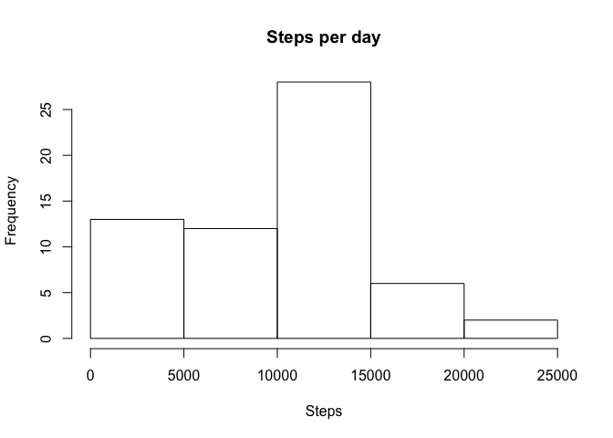
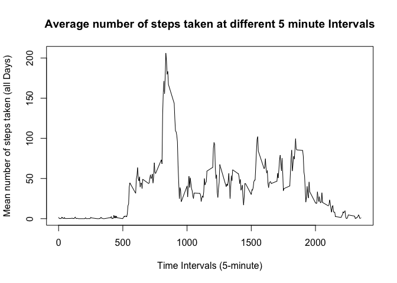
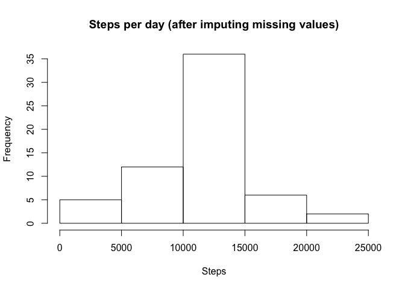
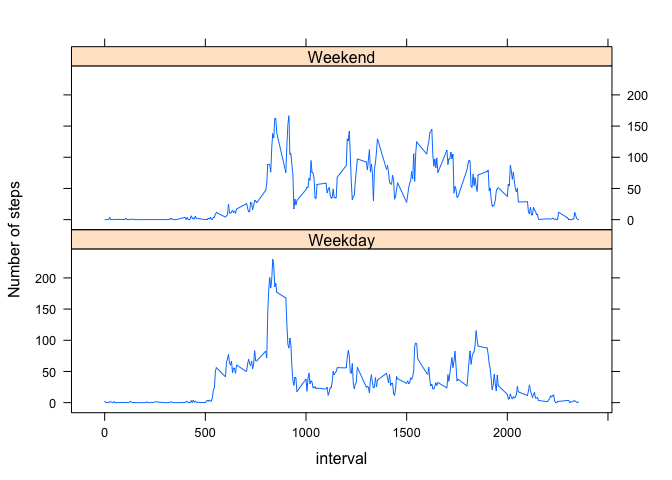

# Reproducible Research: Peer Assessment 1


## Loading and preprocessing the data


```r
activityData = read.csv(file = unzip(zipfile = "activity.zip"))
```


## What is mean total number of steps taken per day?
Starting the analysis by plotting histogram of steps per day from original data.
Additionally calculating "mean" and "median" values of steps per day.

```r
stepsPerDay = with(activityData, tapply(steps, date, sum,na.rm = T))
hist(stepsPerDay, main = "Steps per day", xlab = "Steps")
```

 

```r
meanSteps = mean(stepsPerDay)
medianSteps = median(stepsPerDay)
```

Mean Value of steps per day  is **9354** and median value is **10395**.   Point to be noted is that median and mean values are close but not same.

## What is the average daily activity pattern?
Here is the average 

```r
interval <- unique(activityData$interval)
stepsPerInterval = with(activityData, tapply(steps, interval, mean , na.rm = T))

plot(interval, stepsPerInterval, type='l',
     xlab="Time Intervals (5-minute)", 
     ylab="Mean number of steps taken (all Days)", 
     main="Average number of steps taken at different 5 minute Intervals")
```

 

```r
maxInterval <- names(which.max(stepsPerInterval))
maxIntervalValue <- max(stepsPerInterval)
```

The interval **835** is with maximum averaged number of steps (206 steps).

## Imputing missing values
In existing data set there are missing values which needs to be replaced as presence of missing days may introduce bias into some calculations or summaries of the data. 

```r
naIndex <- is.na(activityData$steps)
naIndexCount <- sum(naIndex)
```
Number of missing values in data set are 2304.  
These values are replaced with mean values on the same time interval, across all days.

```r
activityDataImputed <- activityData
activityDataImputed$steps[which(naIndex)] <- stepsPerInterval[match(activityData$interval[which(naIndex)], interval)]
stepsPerDayImputed <- with(activityDataImputed, tapply(steps, date, sum, na.rm = T))
hist(stepsPerDayImputed, main = "Steps per day (after imputing missing values)", xlab = "Steps")
```

 


```r
meanStepsImputed <- mean(stepsPerDayImputed)
medianStepsImputed <- median(stepsPerDayImputed)
```

After replacing data, mean Value of steps per day  is **10766** and median value is **10766**.  
This replacement of missing values have slight impact on data which is visible in histogram. 

## Are there differences in activity patterns between weekdays and weekends?

```r
finalData <- activityDataImputed
finalData$day <- as.POSIXlt(finalData$date, format = "%Y-%m-%d")$wday
finalData$day[finalData$day == 0 | finalData$day == 6] <- "Weekend"
finalData$day[finalData$day != "Weekend"] <- "Weekday"
finalData$day <- factor(finalData$day)
library(lattice)

stepsPerDayPerIntervalImputed <- with(finalData, aggregate(steps, by = list(interval,day), FUN = mean))

names(stepsPerDayPerIntervalImputed) <- c("interval", "daytype","steps")
xyplot(steps ~ interval | daytype , stepsPerDayPerIntervalImputed, type ='l', layout = c(1,2), ylab = "Number of steps")
```

 

From plot it is clear that, on weekend activity is more distributed but does not reach maximum value of week day. On the other hand, on week day activity is mainly concentrated and also produced peak.

